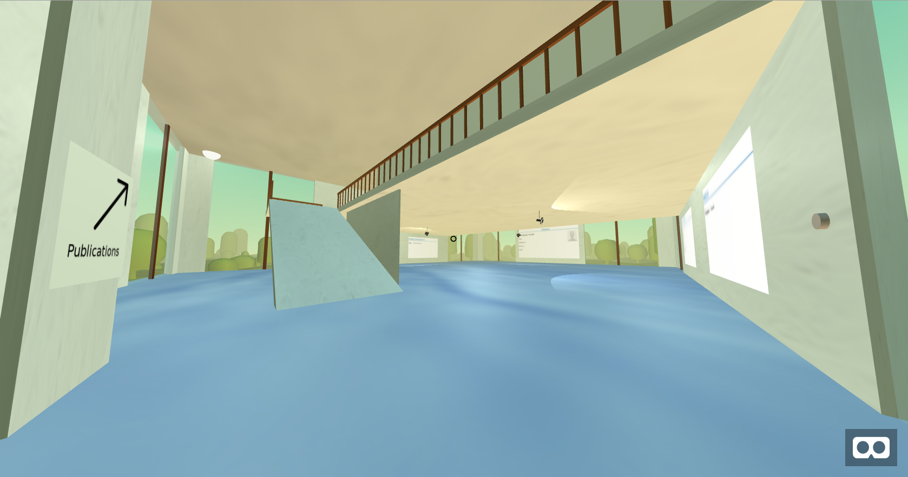
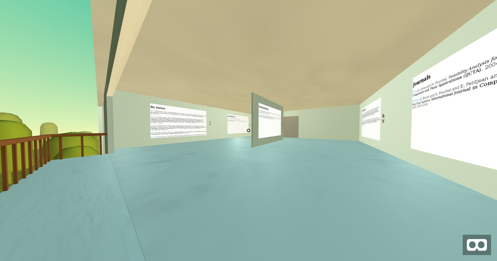
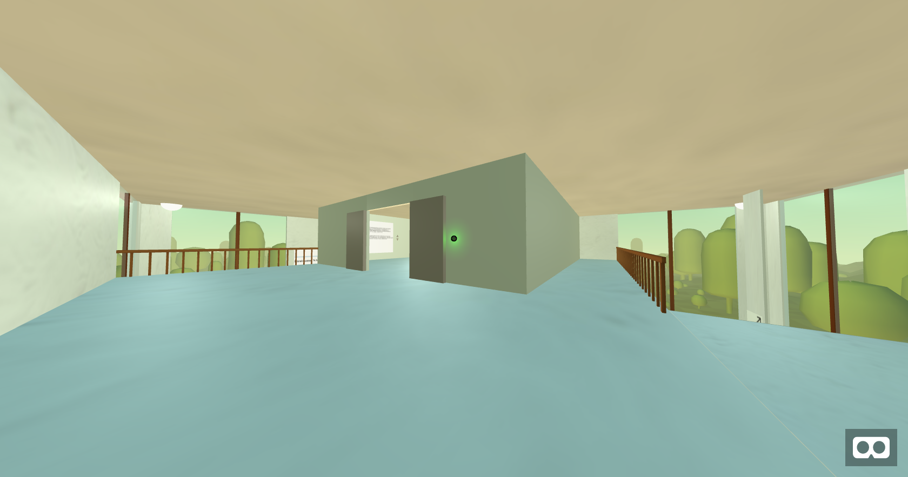

# Description
This app, based on the framework [AFrame](https://aframe.io/) draws in VR a resume within a loft on different 3D panels. In addition, an area is dedicated to researchers, allowing to the show information about publications (conferences, journals and other things).
AFrame allows to visit this 3D CV with many VR techonologies, such as HTC Vive headset, Windows VR, Cardboard, etc. 
The panels are filled with texts stored in a Mysql database. 

# Images

# Requirement
**A web server and a Mysql server.**

# Installation
You need to change the credentials stored in the config file (config folder).
Import the file AFrame-CV-Default.sql, for example with PhpMyAdmin.
Copy the content of this project on the **Web server**.
That's it, call the Web app :-)

# Features
* PHP7
* HTML (W3C) 
* SQL
* JavaScript
* CSS

# Test

## PHPUnit
You can find the test cases on the folder `/testFiles/PHPUnit Tests`

To execute them on the server: 
1. Go on project root.
2. Execute  `./resources/phpunit ./testFiles/PHPUnit Tests/`

Every tests in the folder `PHPUnit Tests` test on class of the folder `model`

* Some tests are lade to test connections and requests on database.
	* `ConnectionTest.php`
	* `ByDateGatewayTest.php`
* Else are here to test the  constructors and the return of getters.
	* `JournalTest.php`
* And the other are lade to test the different methods present in the classes. 
	* `ManagementPlaneTest.php`

## Selenium IDE
1. You need Mozilla ESR 52 (noc 2017)
2. Open every test case and execute it with Selenium IDE.
